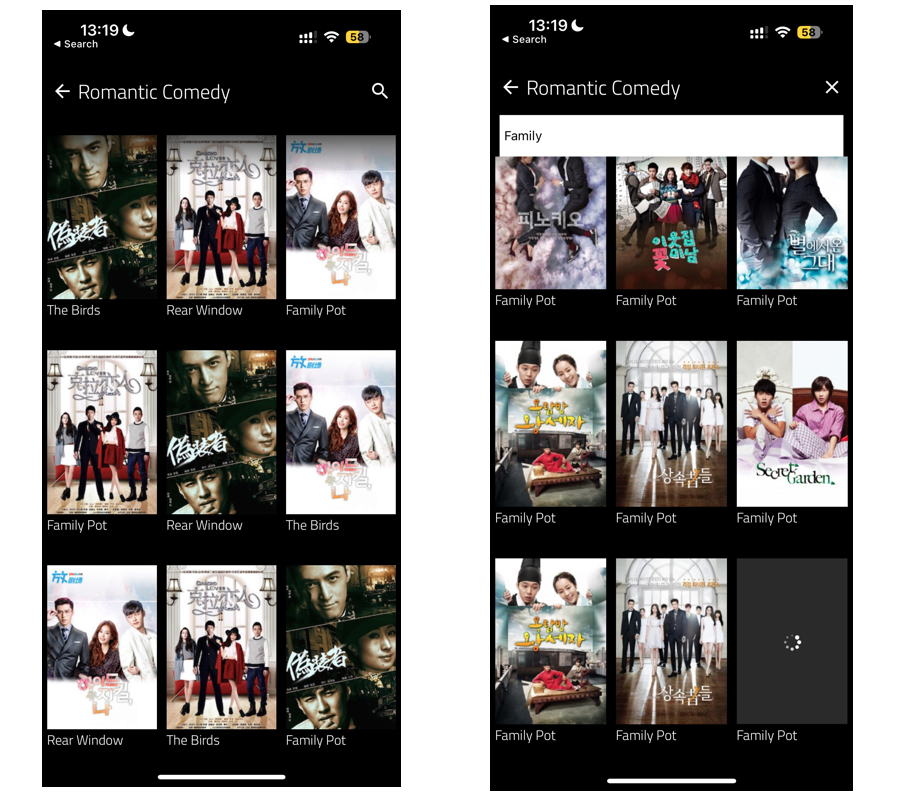

# Lazyloading Movies Mobile App

​
This project is a mobile app developed using React Native Expo with TypeScript. It showcases a collection of romantic comedy movie posters. The app utilizes React Native Flatlist to lazy load posters and Expo Font for custom font usage.
​

## Features

​

- Displays a collection of romantic comedy movie posters
- Lazy loads posters using React Native Flatlist
- Loads additional posters from a JSON file when reaching the end of the list
- Search for a movie using movie name
  ​

## Screenshots

​

​

## Expo QR Code


## Prerequisites

​
Make sure you have the following installed on your machine:
​

- Node.js
- yarn
- Expo CLI
  ​

## Getting Started

​
To get started with the project, follow these steps:
​

1. Clone the repository:
   ​
   ```bash
   git clone https://github.com/Nolunga/lazyloadingmovies.git
   ```
   ​
2. Navigate to project directory:
   ​
   ```bash
   cd lazyloadingmovies
   ```
   ​
3. Install dependencies:
   ​
   ```bash
   yarn install
   ```
   ​
4. Start the Expo development server:
   ​
   ```bash
   expo start
   ```
   ​
5. Follow the instructions from the Expo CLI to launch the app on an emulator or scan the QR code using the Expo Go app on your mobile device.
